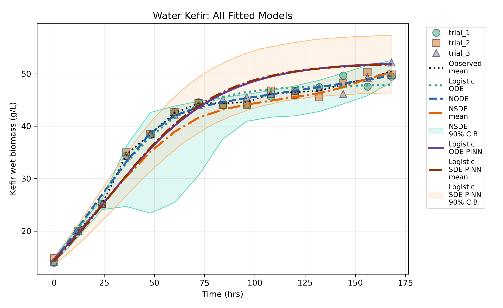

# kefir-models

[](https://github.com/SaulDiazInfante/kefir-models/actions/workflows/ci.yml)
[](https://sauldiazinfante.github.io/kefir-models/)
[](LICENSE)
[](https://www.python.org/)

Neural ODE, Neural SDE, and logistic physics-informed neural network (PINN)
models for analysing **water kefir fermentation** data. The package fits and
compares five dynamical descriptions of the same growth experiment:

1. Classical (Verhulst) logistic ODE.
2. Deterministic Neural ODE.
3. Neural SDE (Itô drift + diffusion, Euler–Maruyama transition likelihood).
4. Deterministic logistic PINN.
5. Stochastic logistic PINN / SDE.

All models are compared with RMSE, R², AIC, BIC, and (for the stochastic
models) predictive-interval coverage on the original response scale.

📖 **Documentation:** <https://sauldiazinfante.github.io/kefir-models/>

## Repository layout

```text
.
├── src/kefir_models/   # Importable package (models, training, plotting)
├── tests/              # pytest suite
├── configs/            # JSON configurations for the CLIs
├── data/raw/           # Raw experimental CSV (immutable input)
├── docs/               # MkDocs site pages + LaTeX report sources
├── results/            # Curated experiment figures (PNG)
├── mkdocs.yml          # Documentation site configuration
├── pyproject.toml      # Packaging + tooling configuration
└── requirements.txt    # Runtime dependencies
```

## Installation

```bash
git clone https://github.com/SaulDiazInfante/kefir-models.git
cd kefir-models
python -m venv .venv
source .venv/bin/activate
pip install -e ".[dev]"
```

`torch` and `torchdiffeq` are required; on most platforms `pip` installs
prebuilt CPU wheels automatically.

## Data

The raw input lives at `data/raw/waterKefirTrialsReferece.csv` (the original
file name spelling is preserved). It contains three trials measured at 15 time
points (45 scalar observations). The CLIs default to
`data/raw/waterKefirTrialsReference.csv` and transparently fall back to the
included file, so the tools work out of the box from the repository root.

## Command-line tools

After installation the following commands are available:

| Command | Purpose |
| --- | --- |
| `kefir-ode-fit` | Fit a Neural ODE to the trial data |
| `kefir-sde-compare` | Compare classical / Neural ODE / Neural SDE fits |
| `kefir-logistic-pinn-compare` | Deterministic and stochastic logistic PINN inverse models |
| `kefir-plot-ode-fit` | Re-plot a saved Neural ODE fit |
| `kefir-plot-pinn-fit` | Re-plot a saved logistic PINN fit |
| `kefir-plot-sde-compare` | Re-plot a saved Neural SDE comparison |
| `kefir-plot-all-models` | Build the combined all-model comparison sequence |

Examples (run from the repository root):

```bash
kefir-ode-fit --config configs/ode_fit_config_reference.json
kefir-sde-compare --config configs/sde_compare_config_reference.json
kefir-logistic-pinn-compare --config configs/logistic_pinn_config_reference.json
```

By default the CLIs write artifacts (CSVs, model checkpoints, PNGs) into
output directories such as `neural_sde_comparison_outputs/`; these are
git-ignored. The curated figures used by the report are committed under
`results/`.

## Results



Additional figures (per-model fits, predictive bands, training objectives, and
step-by-step sequences) are in `results/`.

## Report

The LaTeX report sources are in `docs/`. Build the PDF with:

```bash
cd docs
latexmk -pdf kefir_model_comparison_report.tex
```

## Development

```bash
ruff check .            # lint
ruff format .           # auto-format
pytest -q               # run tests
python -m build         # build sdist + wheel
pre-commit install      # enable git hooks (optional)
```

Tests are fast and deterministic: they use synthetic toy data, fixed seeds, the
non-interactive matplotlib `Agg` backend, and never run full neural-network
training.

## License

Released under the [MIT License](LICENSE).

## Author

Saul Diaz-Infante Velasco (`sauld@cimat.mx`).
