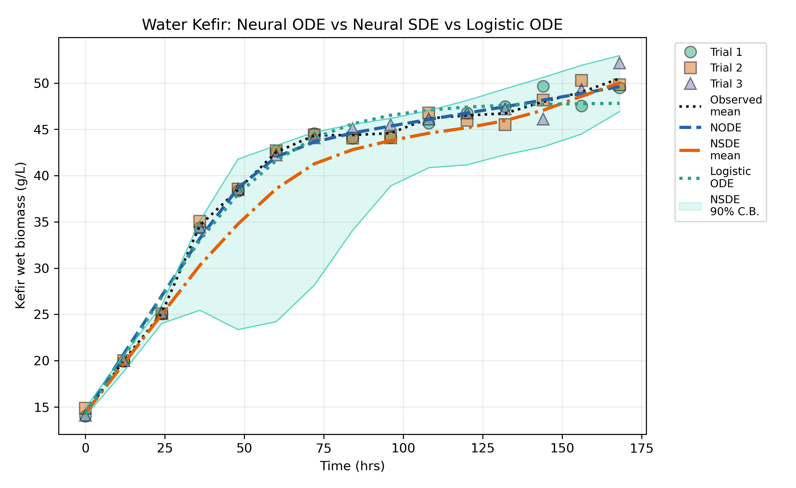
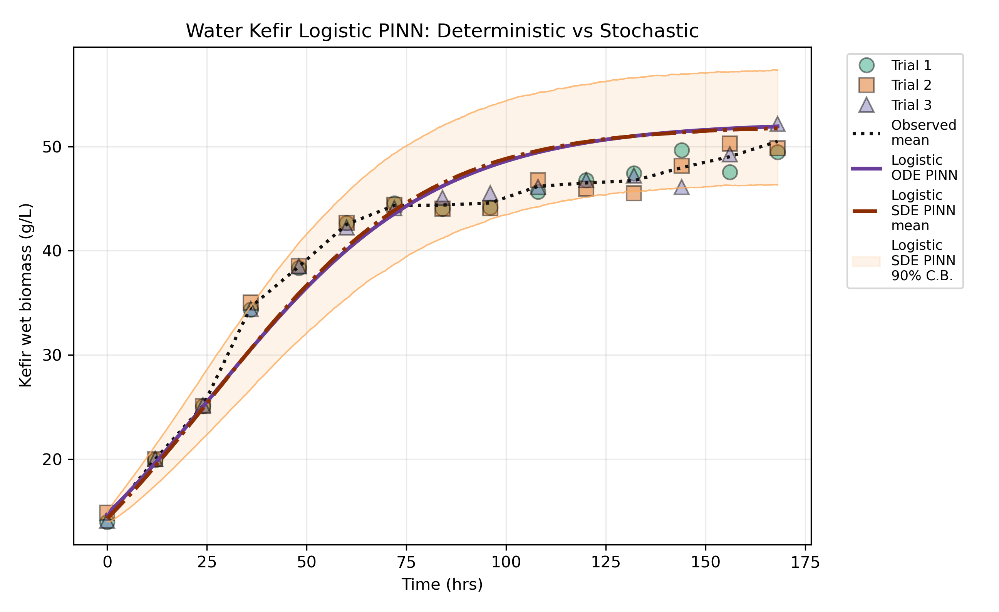
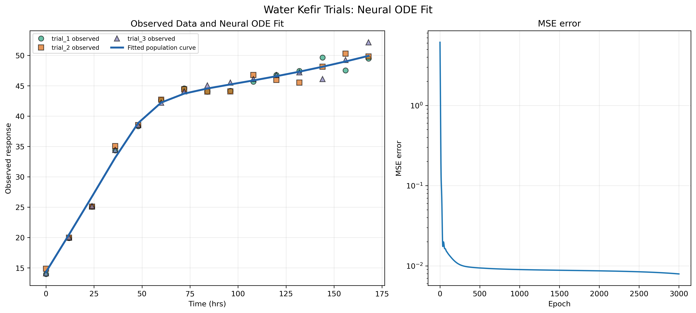
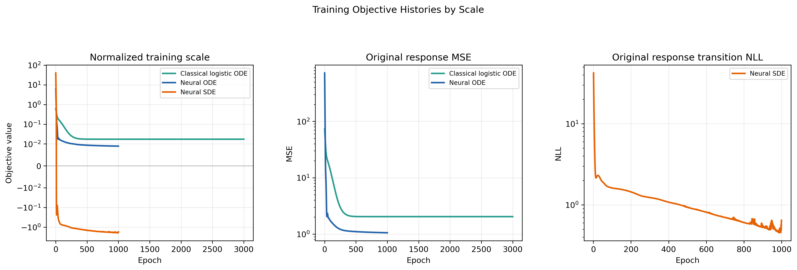

# Results

Curated figures from the water kefir experiments. The full-resolution images and
the step-by-step sequence frames are in the repository under `results/`.

## Summary metrics

In-sample fit quality on the original response scale:

| Model | RMSE | R² |
| --- | --- | --- |
| Classical logistic ODE | 1.4291 | 0.9826 |
| Neural ODE | 1.0281 | 0.9910 |
| Neural SDE | 2.0312 | 0.9649 |
| Deterministic logistic PINN | 2.8167 | 0.9326 |
| Stochastic logistic PINN drift | 2.8469 | 0.9311 |
| Stochastic logistic SDE mean | 3.2324 | 0.9112 |

## All-model comparison

## Neural ODE vs Neural SDE vs logistic ODE

## Logistic PINN comparison

## Single Neural ODE fit

## Training objectives

